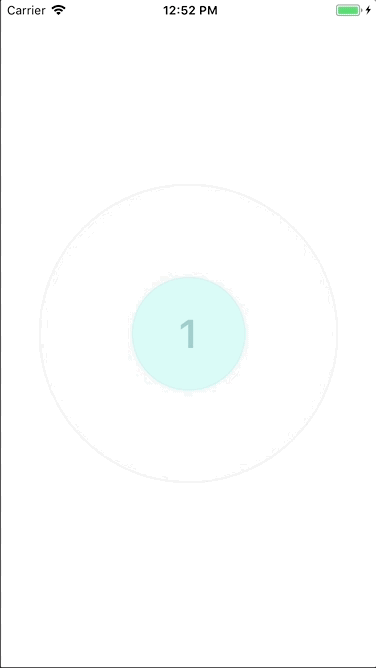
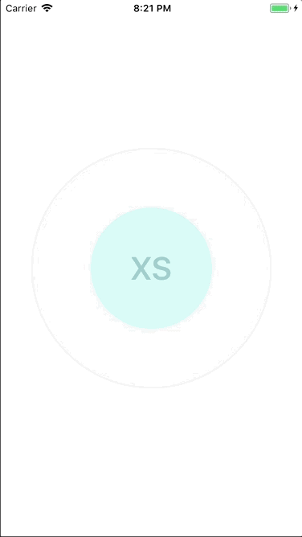

# react-native-circle-size-selector

React Native component to select number (size) with circle dragging (100% Pure JS)

## Preview

|--|--|
|--|--|
||  |

## install

```
npm install --save react-native-circle-size-selector
```

## Basic Usage

```js
import CircleSizeSelector from 'react-native-circle-size-selector'

export default class App extends Component<void, State> {
  state: State = {
    value: InitialValue,
  }

  onChange = (value: number) => {
    this.setState({ value })
  }

  render () {
    return (
      <View style={styles.parent}>
        <CircleSizeSelector
          minValue={1}
          maxValue={7}
          initialValue={1}
          onChange={this.onChange}
        />
        <Text>{this.state}</Text>
      </View>
    )
  }
}
```

## Advanced Usage


### Arbitrary Numbers

You can use arbitrary numbers at selectable values.

```
<CircleSizeSelector
  manualValues={[1, 2, 3, 5, 7, 11, 13]}
  ...
/>
```

### Show children in the circle

You can render elements in the circle by adding children.

```
<CircleSizeSelector
  ...
>
  <View>
    <Text style={styles.text}>
      {this.state.value}
    </Text>
  </View>
</CircleSizeSelector>
```

## Properties

| Prop | Type | Default Value | Description |
|--|--|--|--|
| minValue | number |  | The minimum value of the range. This is required when manualValues is not set. |
| manValue | number |  | The maximum value of the range. This is required when manualValues is not set. |
| manualValues | number  |   | The values that user can select. If you use this, you don't need to set minValue and maxValue. |
| initialValue | number  |   | first value |
| showGraduationLinesOnResizing | boolean |  true | a boolean that defines if we show graduation lines on resizing |
| onChange  | (value) => void |   | function called when value is changed during resizing |
| onSelected | (value) => void  |   | function called when value is selected after resizing  |
| outermostCircleStyle  | StyleObj | `{ borderWidth: 2, borderColor: 'rgb(240, 240, 240)', backgroundColor: 'rgb(247, 247, 247)' }`  | The style of the outermost circle |
| graduationLineCircleStyle | StyleObj  | `{ borderWidth: 1, borderColor: 'rgb(230, 230, 230)' }`  | The style of graduation line circles showed on resizing |
| currentValueCircleStyle  | StyleObj  | `{ borderWidth: 1, borderColor: 'rgb(200, 240, 240)', backgroundColor: 'rgba(201, 250, 245, 0.8)' }`  |  The style of current value circle |
| resizingCurrentValueCircleStyle | StyleObj | `{ backgroundColor: 'rgba(187, 232, 227, 0.6)'` }  | The style of current value circle on resizing |

## Example

Check [App.js](https://github.com/gaishimo/react-native-circle-size-selector/blob/master/Example/App.js) in Example folder.
